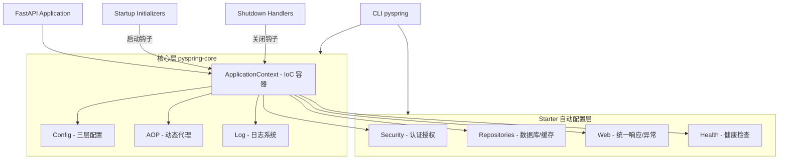

<div align="center">

# PySpring

**企业级 Python Web 框架 —— 为生产力而生的 "Spring Boot for Python"**

[](LICENSE)
[](https://www.python.org/)
[](https://fastapi.tiangolo.com/)
[](https://github.com/psf/black)

</div>

---

## 什么是 PySpring？

**PySpring** 是一个构建于 [FastAPI](https://fastapi.tiangolo.com/) 之上的现代化 Python Web 框架，深度借鉴 Java Spring Boot 的设计哲学，致力于成为 Python 生态中的 "Spring Boot"。

它不是简单的 Web 框架，而是一套**生产环境就绪的基础设施**，通过 **控制反转（IoC）**、**依赖注入（DI）**、**面向切面编程（AOP）** 与 **约定优于配置**，解决大型 Python 项目中的代码耦合、配置混乱与结构随意等痛点。

PySpring 采用 **Starter 化（Auto-Configuration）** 与 **PEP 420 命名空间包** 架构：核心能力始终加载，业务能力（安全、数据访问、Web、健康检查）按需引入，即插即用。

---

## 核心架构

PySpring 由多个可独立发布、按需引入的 Starter 组成，所有包共享统一 `pyspring` 命名空间：



### 架构分层

| 层 | 发行包 | 导入命名空间 | 职责 |
|----|--------|-------------|------|
| 核心层 | `pyspring-core` | `pyspring.core` | IoC 容器、AOP、日志、配置（**始终加载**） |
| 安全 | `pyspring-security` | `pyspring.security` | 认证（JWT）、授权（RBAC）、密码编码 |
| 数据 | `pyspring-repositories` | `pyspring.repositories` | 数据库 ORM、缓存抽象（Redis/Memory/Memcached） |
| Web | `pyspring-web` | `pyspring.web` | 统一响应格式、全局异常处理 |
| 健康 | `pyspring-health` | `pyspring.health` | 健康检查指标 |
| CLI | `pyspring-cli` | `pyspring.cli` | 项目初始化、诊断、环境管理 |
| 聚合 | `pyspring` | `pyspring` | 聚合核心 + 常用 starter，含项目模板 |

> **Starter 机制**：每个 Starter 通过 Python `entry-points`（`pyspring.starters` 组）声明自动配置类，容器启动时自动发现并装配。引入即用，不引用不影响核心。

---

## 核心能力

### 1. 智能 IoC 容器

不只是依赖注入，更是性能与健壮性的结合：

- **极速启动**：内置智能扫描缓存，大型项目启动显著提速。
- **循环依赖防护**：启动时自动进行 DAG 依赖图谱分析，杜绝运行时循环引用。
- **零配置注入**：加上 `@Component` / `@Service`，容器自动托管生命周期。
- **默认单例**：节省内存，配合 `ContextVars` 支持高并发请求隔离。

### 2. AOP 切面编程

运行时动态代理，让业务逻辑纯净：

- **非侵入式增强**：无需修改业务代码即可添加日志、监控、事务。
- **声明式切面**：`@Before`、`@After`、`@Around` 轻松定义增强逻辑。
- **动态代理**：运行时自动包装实例，支持方法切入点匹配。

### 3. 生产级安全

- **认证链模式**：JWT、API Key 等多种认证方式并行，按优先级自动匹配。
- **全链路加密**：Token 负载加密（Fernet/AES-GCM）。
- **智能鉴权**：白名单机制 + RBAC 角色权限控制。

### 4. 应用生命周期

像 Spring 一样管理应用各阶段：

- **Startup Initializers**：启动时自动执行数据迁移、缓存预热、服务探活。
- **Shutdown Handlers**：优雅停机，确保连接池关闭、资源释放。

### 5. 统一数据抽象

- **数据库透明化**：一套代码，配置即可在 PostgreSQL / MySQL / SQLite 间切换。
- **缓存抽象层**：接口统一，从内存缓存平滑升级到 Redis，无需改业务代码。

---

## 快速上手

### 1. 安装

**临时使用（无需安装，推荐新用户）**

```bash
# 一键创建项目（自动下载临时 PySpring，用完即删）
uvx --from pyspring pyspring init my-project --example
cd my-project
```

**开发环境安装**

```bash
pipx install pyspring        # 全局 CLI（推荐，隔离安装）
uv tool install pyspring     # 或使用 uv
```

**在项目中安装（开发模式）**

```bash
uv pip install "pyspring[full]"
```

### 2. 初始化项目

```bash
pyspring init
```

生成标准工程结构，包含完整的 YAML 配置模板、认证脚手架与测试套件。

### 3. 体验自动注入

```python
from pyspring.core.ioc import ApplicationContext
from pyspring.core.ioc import Component

@Component
class UserService:
    def __init__(self, db_manager: "DBManagerService"):
        self.db = db_manager

    def get_users(self):
        return self.db.query("SELECT * FROM users")
```

```python
# 初始化应用上下文并获取服务
app_context = ApplicationContext.initialize(base_packages=["app"])
user_service = app_context.get_by_type(UserService)
users = user_service.get_users()
```

---

## 命令行工具

| 命令 | 说明 |
|------|------|
| `pyspring init` | 初始化标准项目结构 |
| `pyspring check` | 检查项目健康（循环依赖、导入、编码等） |
| `pyspring dev` | 开发工作流辅助 |
| `pyspring clean` | 清理缓存与构建产物 |
| `pyspring security` | 安全相关检查 |
| `pyspring uv` | 封装 uv 环境管理 |

---

## 文档

完整的文档体系见 [`docs/`](docs/README.md)，从整体架构到局部细节分门别类：

- [文档总入口](docs/README.md)
- [架构设计](docs/00-architecture/)
- [快速入门](docs/QUICK_START.md)

---

## 发布管理

PySpring 采用**多包独立发布**策略，各 Starter 独立维护版本与发布：

```bash
# 发布聚合包到 TestPyPI
./scripts/publish-individual.ps1 pyspring test

# 发布 CLI 到 TestPyPI
./scripts/publish-individual.ps1 pyspring-cli test
```

发行包名（`pyspring-security`）与导入名（`pyspring.security`）解耦，符合 PEP 420 命名空间包规范。

---

## 贡献与支持

- 🐛 **报告 Bug**：[GitHub Issues](https://github.com/365tools/PySpring/issues)
- 💬 **参与讨论**：[GitHub Discussions](https://github.com/365tools/PySpring/discussions)

---

## 开源协议

本项目采用 **Apache License 2.0** 协议开源。

Copyright © 2026 [Yingchun] (365tools)
