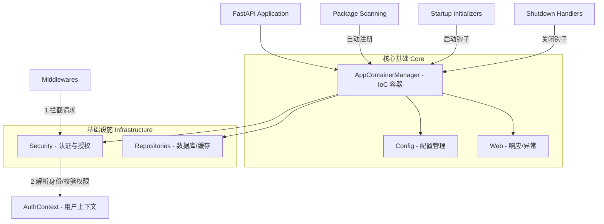

<div align="center">

# PySpring 🚀

**企业级 Python Web 框架 - 为生产力而生的 "Spring Boot for Python"**

[](LICENSE)
[](https://www.python.org/)
[](https://fastapi.tiangolo.com/)
[](https://github.com/psf/black)

</div>

---

## 🌟 什么是 PySpring？

**PySpring** 是一个基于 [FastAPI](https://fastapi.tiangolo.com/) 构建的、深受 Java Spring Boot 设计哲学启发的现代化 Python Web 框架。它不仅仅是一个 Web 框架，更是一套生产环境就绪的基础设施。

旨在通过 **控制反转 (IoC)**、**依赖注入 (DI)** 和 **约定优于配置** 的原则，解决大型 Python 项目中常见的代码耦合、配置混乱和结构随意等痛点，帮助开发者构建可扩展、易维护的后端应用。

---

## 🏗️ 核心架构

PySpring 内部各组件通过 IoC 容器紧密协作，形成了一个稳固的生命周期闭环。



---

## ✨ 四大核心支柱

### 1. 智能 IoC 容器 (Smart IoC 2.0)

不仅仅是依赖注入，更是性能与健壮性的结合。

- **极速启动**：内置智能扫描缓存（Startup Cache），大项目启动速度提升 80% 以上。
- **循环依赖防护**：启动时自动进行 DAG 依赖图谱分析，杜绝循环引用导致的运行时栈溢出风险。
- **零配置注入**：只需加上 `@Component` 或 `@Service`，容器自动托管生命周期。
- **单例与并发**：默认单例（Singleton）设计节省内存，配合 `ContextVars` 完美支持高并发请求隔离。

### 2. AOP 切面编程 (New in v1.0.1)

引入运行时期动态代理，实现业务逻辑纯净化。

- **非侵入式增强**：无需修改业务代码，即可添加日志记录、性能监控、事务管理。
- **声明式切面**：使用 `@Before`, `@After`, `@Around` 轻松定义增强逻辑。
- **动态代理**：运行时自动包装 Service 实例，支持正则匹配方法切入点。

### 3. 生产级安全体系 (Security First)

无需从零编写复杂的认证逻辑，PySpring 内置了企业级安全特性：

- **认证链模式**：支持 JWT、API Key 等多种认证方式并行，按优先级自动匹配，易于扩展。
- **全链路加密**：内置 Token 负载加密（Fernet/AES-GCM），确保敏感信息在传输和存储中的绝对安全。
- **智能鉴权**：开箱即用的白名单机制（精确/前缀/正则）及 RBAC 角色权限控制。

### 3. 应用生命周期钩子 (Lifecycle Hooks)

像 Spring 一样管理应用的每一个阶段，告别 `main.py` 中的面条代码。

- **Startup Initializers**：启动时自动执行数据迁移、缓存预热或第三方服务探活。
- **Shutdown Handlers**：优雅停机，确保数据库连接池关闭、临时资源正常释放，防止数据丢失。

### 4. 统一数据抽象 (Unified DAL)

- **数据库透明化**：一套代码，通过配置即可在 PostgreSQL 和 SQLite 间无缝切换，利于开发与生产环境隔离。
- **缓存抽象层**：接口统一，支持从本地内存缓存平滑升级到 Redis 集群，无需修改业务代码。

---

## 🚀 快速上手

### 1. 安装

#### 临时使用（无需安装）- 推荐新用户 ⚡

使用 [uvx](https://github.com/astral-sh/uv) 零安装快速创建项目：

```bash
# 一键创建项目（自动下载临时 PySpring，用完即删）
uvx --from pyspring pyspring init my-project --example
cd my-project
```

> **为什么推荐 uvx？**
> - ✅ 无需提前安装 PySpring
> - ✅ 自动使用最新版本
> - ✅ 隔离环境，不污染全局
> - ✅ 类似 npx，用完即删

#### 开发环境安装 🛠️

如果需要频繁使用 CLI 工具，可全局安装：

```bash
# 方式 1：使用 pipx（推荐，隔离安装）
pipx install pyspring

# 方式 2：使用 uv tool（现代化）
uv tool install pyspring

# 方式 3：在项目中安装（包含开发工具）
uv pip install "pyspring[full]"
```

#### 生产环境安装 🚀

生产环境只需核心框架，无需开发工具：

```bash
# 标准安装（包含 CLI，但生产环境通常不使用）
pip install pyspring

# 或使用 uv（更快）
uv pip install pyspring
```

> **注意**：CLI 工具代码会被安装（约 50 KB），但不会影响运行时性能。  
> 详见 [生产环境部署指南](docs/PRODUCTION_DEPLOYMENT.md)。

#### 安装方式对比

| 方式                           | 适用场景      | CLI 可用 | 开发工具 |
|------------------------------|-----------|--------|------|
| `uvx --from pyspring`        | 临时创建项目    | ✅ 临时   | ❌    |
| `pipx install pyspring`      | 全局 CLI 工具 | ✅ 是    | ❌    |
| `pip install pyspring[full]` | 开发环境      | ✅ 是    | ✅ 是  |
| `pip install pyspring`       | 生产环境      | ✅ 是*   | ❌    |

*生产环境的 CLI 通常不使用，但会被安装（无额外依赖）。

### 2. 初始化项目

```bash
pyspring init
```

该命令会引导你生成标准的工程结构，包含完整的配置模板（YAML）、认证逻辑脚手架和测试套件。

### 3. 体验“自动注入”

在 `app/services/user_service.py` 中定义服务：
```python
from pyspring.core.interfaces.ISingleton import ISingletonService
# 假设有一个已存在的 DBManagerService

class UserService(ISingletonService):
    # 类型提示触发自动注入
    def __init__(self, db_manager: 'DBManagerService'): 
        self.db = db_manager

    def get_users(self):
        return self.db.query("SELECT * FROM users")
```

在业务代码中使用：

```python
from pyspring.ioc.manager import AppContainerManager
from app.services.user_service import UserService

# 框架会在启动时自动扫描并注册 UserService
container = AppContainerManager()
user_service = container.get(UserService)

users = user_service.get_users()
```

---

## 🛠️ 命令行工具 (CLI)

PySpring 提供了一套强大的命令行工具，协助你管理项目全生命周期。

### 1. 初始化 (Init)

快速生成符合最佳实践的标准项目结构。

```bash
pyspring init         # 当前目录初始化
pyspring init -f      # 强制覆盖
```

### 2. 环境管理 (UV Manager)

内置对 `uv` 的原生支持，一键配置高性能 Python 环境。

```bash
pyspring uv setup     # 创建/修复环境
pyspring uv setup --dev # 安装开发依赖
```

### 3. 诊断 (Diagnose)

由于 Python 环境配置复杂，当 IDE 无法识别包或运行时报错时，使用此工具自检。

```bash
pyspring diagnose     # 检查环境、路径和安装状态
```

---

## 📊 为什么选择 PySpring？

| 特性       | 原生 FastAPI           | PySpring                                |
|:---------|:---------------------|:----------------------------------------|
| **项目结构** | 需自行设计，容易混乱           | **标准化目录结构，最佳实践落地**                      |
| **依赖注入** | `Depends` 基于函数，较零散   | **集中式 IoC 容器，支持类与单例的全自动处理**             |
| **安全认证** | 需手动集成 OAuth2/JWT     | **内置责任链认证、负载加密、RBAC**                   |
| **配置管理** | 基于环境变量或 .env         | **统一 YAML 配置体系，支持多环境覆盖与对象映射**           |
| **生命周期** | 简单的 startup/shutdown | **结构化 Initializer/Shutdown Handler 体系** |
| **数据访问** | 需手动配置引擎与连接           | **配置驱动，支持多库/多缓存透明切换**                   |

---

## 📂 项目结构规范

`pyspring init` 生成的标准结构如下：

```text
your-project/
├── app/                  # 业务代码 (自动扫描核心区域)
│   ├── api/              # 路由接口 (Controller)
│   ├── services/         # 业务逻辑 (Service)
│   ├── handlers/         # 生命周期处理器 (Handler)
│   └── models/           # 数据实体
├── config/               # 配置文件 (YAML)
│   ├── application.yaml  # 应用全局配置
│   ├── container.yaml    # IoC 容器扫描路径配置
│   ├── security.yaml     # 安全策略与白名单
│   └── repositories.yaml # 数据库源与缓存配置
├── logs/                 # 运行日志
├── scripts/              # 维护脚本 (如 SQL 初始化)
├── main.py               # 应用入口
└── .env                  # 敏感变量 (API Key, Secrets)
```

---

## 🧩 扩展与自定义指南

PySpring 设计为开放架构，你几乎可以替换任何组件。以下是常见的扩展场景：

### 1. 业务逻辑开发

- **Service 层**: 继承 `ISingletonService`，并在构造函数中声明依赖。
  ```python
  class MyService(ISingletonService): ...
  ```
- **API 响应**: 使用 `Response.success()` 和 `Response.error()` 统一格式，或继承 `HttpResponse[T]` 定制字段。

### 2. 生命周期管理

- **启动任务**: 实现 `IStartupInitializer` 接口。
  > 场景：缓存预热、检查第三方 API连通性、加载机器学习模型。
  ```python
  class ModelLoader(IStartupInitializer):
      def get_name(self) -> str: return "AIModelLoader"
      async def initialize(self) -> bool: ...
  ```
- **关闭清理**: 实现 `IShutdownHandler` 接口。
  > 场景：关闭非标数据库连接、发送停机通知。

### 3. 安全体系扩展

- **自定义认证源**: 继承 `BaseAuthenticationProvider` 并注册到容器。
  > 场景：集成 LDAP、通过原有系统的 Cookie 验证。
- **自定义权限校验**: 如果内置的 RBAC 不满足需求，可直接替换 `RoleBasedAccessControl` 中间件。

### 4. 数据层扩展

- **新数据库支持**: 如果不想用 SQLAlchemy，可以实现 `IDBService` 接口接入 MongoEngine 或 Tortoise-ORM。

---

## 🛠️ 开发者工具

- **命令行工具 (`pyspring`)**:
    - `pyspring init`: 快速生成项目脚手架。
    - `pyspring diagnose`: 自动诊断环境依赖、导入错误与配置问题。
    - `pyspring uv`: 封装 uv 命令，简化依赖管理。

- **代码辅助**:
    - `AppContainerManager.service(Xxx)`: 在非注入环境（如脚本中）快速获取服务实例。

---

## 🤝 贡献与支持

PySpring 是一个开源项目，欢迎任何形式的贡献！

- 🐛 **报告 Bug**：请提交 [GitHub Issues](https://github.com/365tools/PySpring/issues)
- 💬 **参与讨论**：欢迎在 [GitHub Discussions](https://github.com/365tools/PySpring/discussions) 中分享想法

---

## 📄 开源协议

本项目采用 **Apache License 2.0** 协议开源。

Copyright © 2026 [Yingchun] (365tools)
