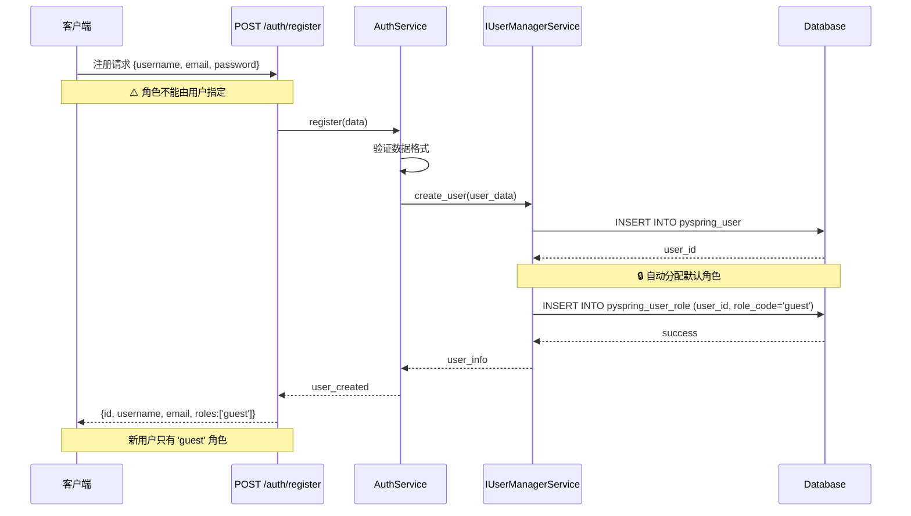
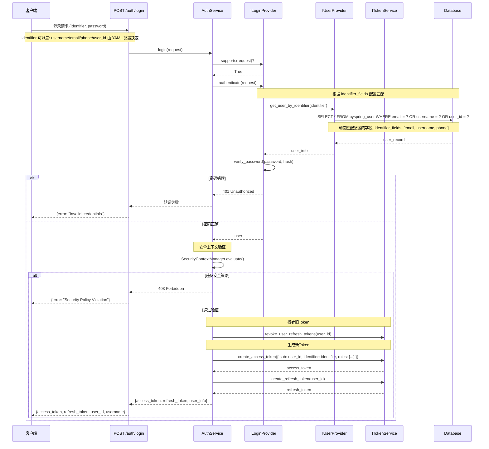
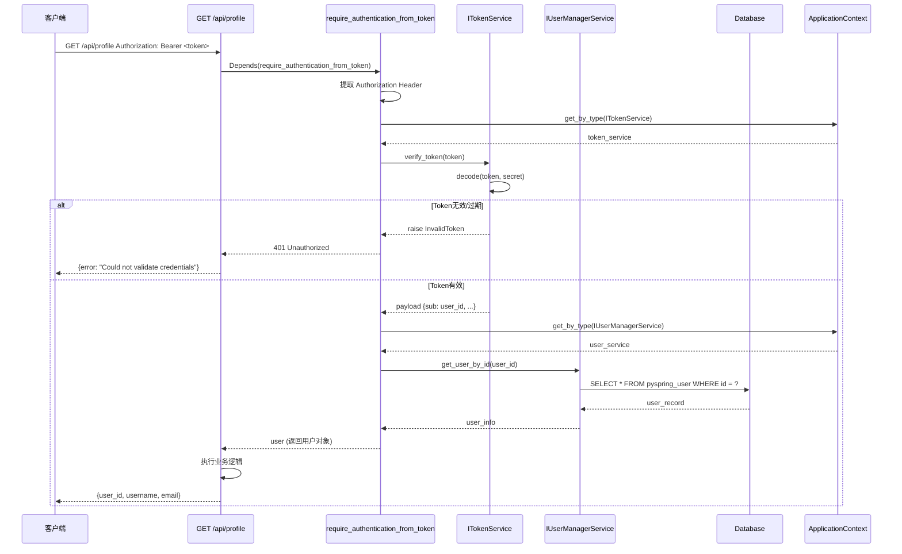
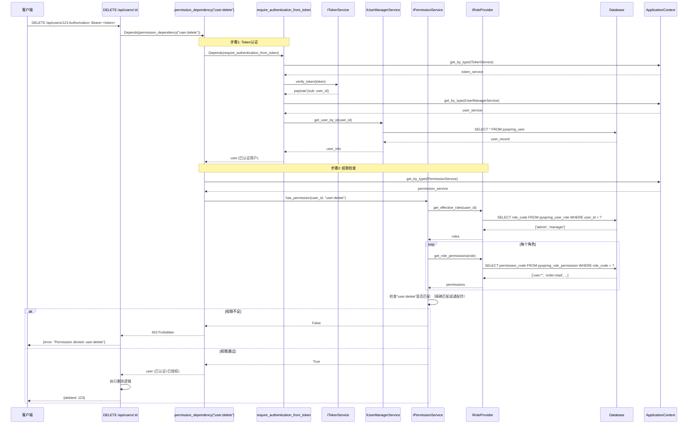
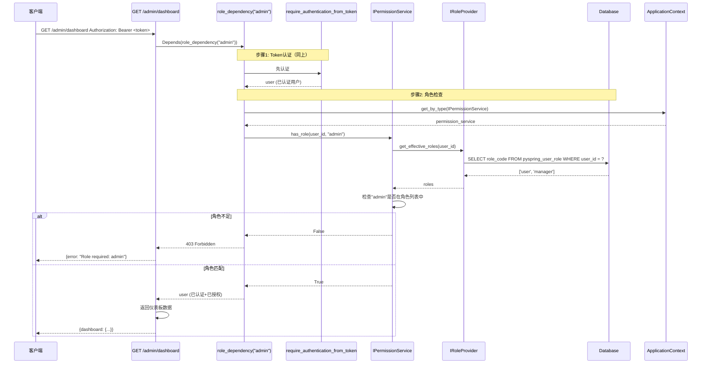
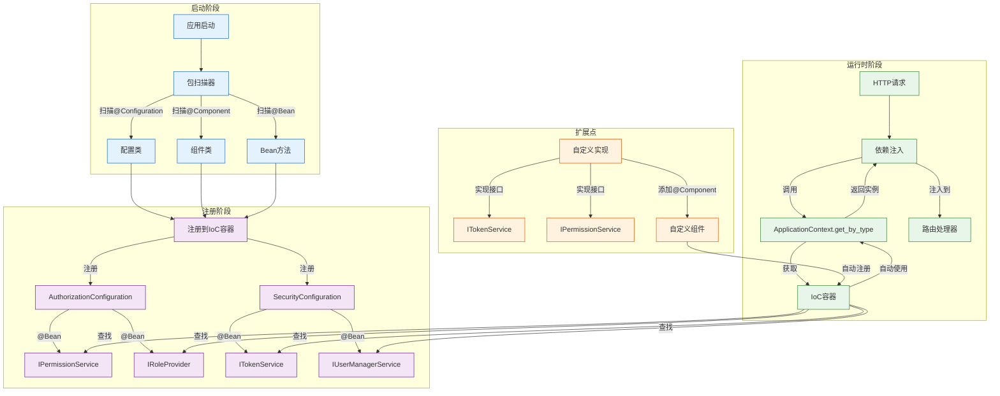
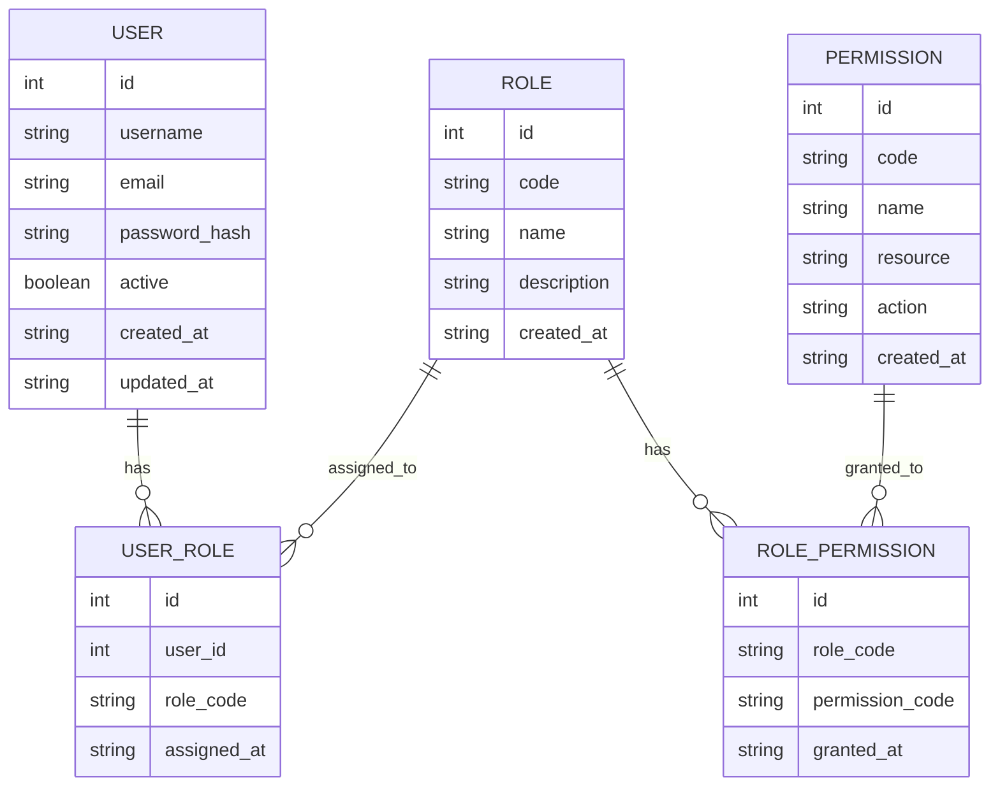
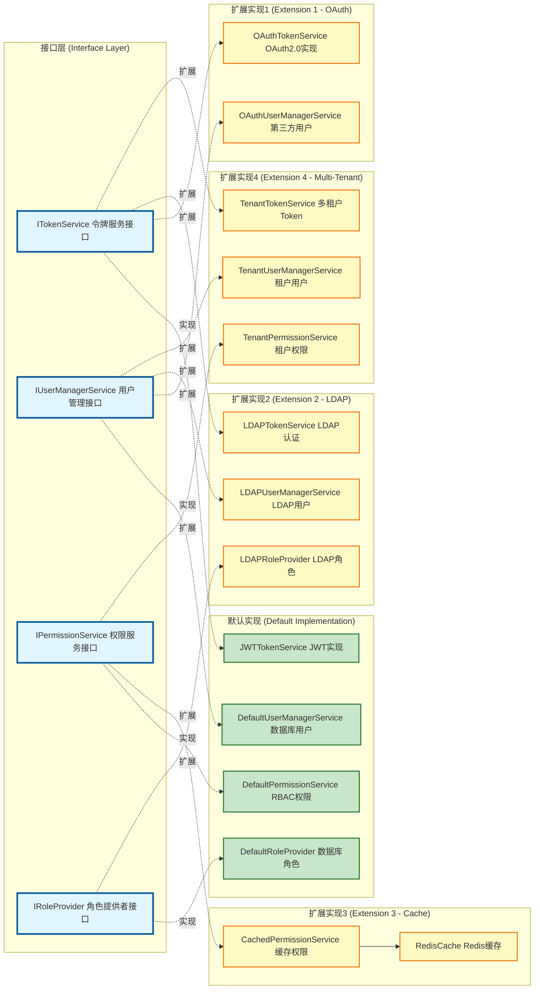
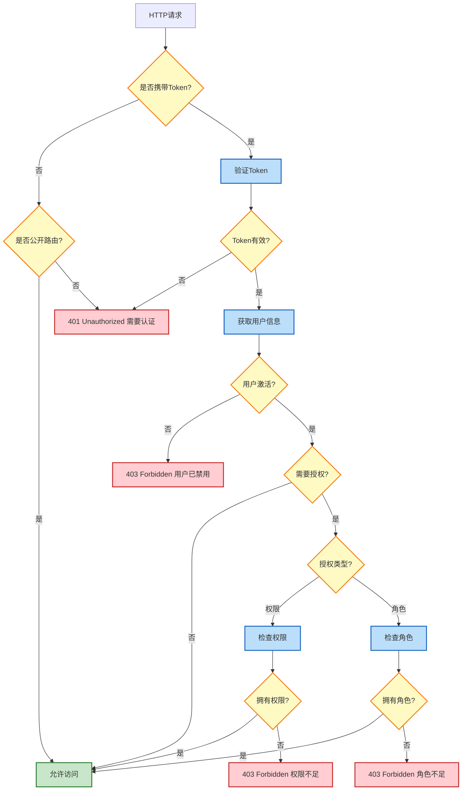

# PySpring 认证授权架构图

## 完整架构图

```mermaid
graph TB
    subgraph ClientLayer["外部用户层"]
        Client["客户端"]
    end

    subgraph APIGateway["API网关层"]
        Register["POST /auth/register"]
        Login["POST /auth/login"]
        Protected["GET /api/resource"]
        PermRoute["DELETE /api/users/:id"]
        RoleRoute["GET /admin/dashboard"]
    end

    subgraph AuthMiddleware["认证中间层"]
        direction TB
        TokenDep[Token认证依赖 require_authentication_from_token]
        PermDep[权限依赖 permission_dependency]
        RoleDep[角色依赖 role_dependency]
        
        TokenDep --> |验证Token| TokenService
        PermDep --> |1.先认证| TokenDep
        PermDep --> |2.再授权| PermService
        RoleDep --> |1.先认证| TokenDep
        RoleDep --> |2.再授权| PermService
    end

    subgraph CoreService["核心服务层"]
        direction TB
        
        subgraph AuthenticationService["认证服务"]
            AuthService["AuthService"]
            LoginProvider["ILoginProvider"]
            UserProvider["IUserProvider"]
            TokenService["ITokenService"]
            
            AuthService --> LoginProvider
            AuthService --> UserProvider
            AuthService --> TokenService
        end
        
        subgraph AuthorizationService["授权服务"]
            PermService["IPermissionService"]
            RoleProvider["IRoleProvider"]
            
            PermService --> RoleProvider
        end
    end

    subgraph ImplLayer["实现层"]
        direction TB
        
        subgraph TokenImpl["令牌实现"]
            JWTService["JWTTokenService"]
            SessionService["SessionTokenService"]
            APIKeyService["APIKeyTokenService"]
        end
        
        subgraph UserImpl["用户管理实现"]
            DefaultUserMgr["DefaultUserManagerService"]
            CustomUserMgr["CustomUserManagerService"]
        end
        
        subgraph PermImpl["权限实现"]
            DefaultPerm["DefaultPermissionService"]
            CachedPerm["CachedPermissionService"]
        end
        
        subgraph RoleImpl["角色提供者实现"]
            DBRoleProvider["DefaultRoleProvider"]
            ConfigRoleProvider["ConfigRoleProvider"]
        end
        
        TokenService -.实现.-> JWTService
        TokenService -.实现.-> SessionService
        TokenService -.实现.-> APIKeyService
        
        UserProvider -.实现.-> DefaultUserMgr
        UserProvider -.实现.-> CustomUserMgr
        
        PermService -.实现.-> DefaultPerm
        PermService -.实现.-> CachedPerm
        
        RoleProvider -.实现.-> DBRoleProvider
        RoleProvider -.实现.-> ConfigRoleProvider
    end

    subgraph IoCContainer["IoC容器"]
        AppContext["ApplicationContext"]
        
        AppContext -->|"自动注入"| TokenService
        AppContext -->|"自动注入"| UserProvider
        AppContext -->|"自动注入"| PermService
        AppContext -->|"自动注入"| RoleProvider
    end

    subgraph DataLayer["数据层"]
        direction TB
        
        subgraph ORMModels["ORM模型"]
            UserTable[("UserTable")]
            RoleTable[("RoleTable")]
            PermTable[("PermissionTable")]
            UserRoleTable[("UserRoleTable")]
            RolePermTable[("RolePermissionTable")]
        end
        
        subgraph CacheLayer["缓存层"]
            Cache[("Redis/Memcached")]
        end
        
        DefaultUserMgr --> UserTable
        DefaultUserMgr --> UserRoleTable
        
        DBRoleProvider --> RoleTable
        DBRoleProvider --> PermTable
        DBRoleProvider --> RolePermTable
        
        CachedPerm --> Cache
    end

    %% 用户注册流程
    Client -->|"1.注册"| Register
    Register --> AuthService
    AuthService -->|"创建用户"| DefaultUserMgr
    DefaultUserMgr -->|"插入"| UserTable
    DefaultUserMgr -->|"分配角色"| UserRoleTable
    
    %% 用户登录流程
    Client -->|"2.登录"| Login
    Login -->|"查找Provider"| LoginProvider
    LoginProvider -->|"identifier匹配"| UserProvider
    UserProvider -->|"动态字段匹配"| UserTable
    UserProvider -->|"验证密码"| LoginProvider
    LoginProvider -->|"安全验证"| AuthService
    AuthService -->|"验证密码"| DefaultUserMgr
    DefaultUserMgr -->|"查询"| UserTable
    AuthService -->|"生成Token"| JWTService
    JWTService -->|"返回Token"| Client
    
    %% 访问受保护资源
    Client -->|"3.访问资源"| Protected
    Protected --> TokenDep
    TokenDep -->|"验证"| JWTService
    JWTService -->|"解析payload"| TokenDep
    TokenDep -->|"获取用户"| DefaultUserMgr
    DefaultUserMgr -->|"查询"| UserTable
    TokenDep -->|"返回用户"| Protected
    
    %% 访问需要权限的资源
    Client -->|"4.访问"| PermRoute
    PermRoute --> PermDep
    PermDep -->|"has_permission"| DefaultPerm
    DefaultPerm -->|"get_roles"| DBRoleProvider
    DBRoleProvider -->|"查询"| UserRoleTable
    DBRoleProvider -->|"查询"| RolePermTable
    DefaultPerm -->|"检查权限"| PermDep
    PermDep -->|"403或通过"| PermRoute
    
    %% 访问需要角色的资源
    Client -->|"5.访问"| RoleRoute
    RoleRoute --> RoleDep
    RoleDep -->|"has_role"| DefaultPerm
    DefaultPerm -->|"get_roles"| DBRoleProvider
    RoleDep -->|"403或通过"| RoleRoute

    %% 样式定义
    classDef clientStyle fill:#e1f5ff,stroke:#01579b,stroke-width:2px
    classDef apiStyle fill:#fff3e0,stroke:#e65100,stroke-width:2px
    classDef authStyle fill:#f3e5f5,stroke:#4a148c,stroke-width:2px
    classDef serviceStyle fill:#e8f5e9,stroke:#1b5e20,stroke-width:2px
    classDef implStyle fill:#fff9c4,stroke:#f57f17,stroke-width:2px
    classDef dataStyle fill:#fce4ec,stroke:#880e4f,stroke-width:2px
    classDef iocStyle fill:#e0f2f1,stroke:#004d40,stroke-width:3px
    
    class Client clientStyle
    class Register,Login,Protected,PermRoute,RoleRoute apiStyle
    class TokenDep,PermDep,RoleDep authStyle
    class AuthService,TokenService,UserProvider,PermService,RoleProvider serviceStyle
    class JWTService,SessionService,APIKeyService,DefaultUserMgr,CustomUserMgr,DefaultPerm,CachedPerm,DBRoleProvider,ConfigRoleProvider implStyle
    class UserTable,RoleTable,PermTable,UserRoleTable,RolePermTable,Cache dataStyle
    class AppContext iocStyle
```



## 用户注册流程



## 用户登录流程



## Token认证流程（仅认证）



## 权限验证流程（认证+授权）



## 角色验证流程（认证+授权）



## IoC容器服务注册与发现



## 数据库ER图



### 数据示例

**USER表**：

- id: 主键（PK）
- username, email: 唯一键（UK）

**ROLE表**：

- id: 主键（PK）
- code: 唯一键（UK），值如 `admin`, `manager`, `guest`
- name: `管理员`, `经理`, `访客`

**PERMISSION表**：

- id: 主键（PK）
- code: 唯一键（UK），值如 `user:read`, `user:write`, `order:delete`
- resource: `user`, `order`
- action: `read`, `write`, `delete`

**USER_ROLE表**：

- id: 主键（PK）
- user_id: 外键（FK）→ USER.id
- role_code: 外键（FK）→ ROLE.code

**ROLE_PERMISSION表**：

- id: 主键（PK）
- role_code: 外键（FK）→ ROLE.code
- permission_code: 外键（FK）→ PERMISSION.code

## 可扩展性架构



## 认证授权决策树



## 架构特点总结

### 🎯 核心特性

1. **分层架构**
    - API网关层：路由定义
    - 认证中间层：Token验证、权限检查
    - 核心服务层：业务逻辑接口
    - 实现层：具体实现
    - 数据层：数据库、缓存

2. **接口驱动**
    - ITokenService：令牌服务接口
    - IUserManagerService：用户管理接口
    - IPermissionService：权限服务接口
    - IRoleProvider：角色提供者接口

3. **IoC容器**
    - 自动服务发现
    - 依赖注入
    - 单例管理

4. **可扩展性**
    - JWT/OAuth/LDAP/多租户令牌
    - 数据库/LDAP角色提供者
    - 默认/缓存权限服务
    - 自定义实现无缝集成

5. **安全性**
    - Token认证
    - 权限控制（RBAC）
    - 角色控制
    - 通配符权限

### 🔐 认证流程

```
注册（默认guest角色）→ 登录 → 获取Token → 携带Token访问 → 验证Token → 检查权限/角色 → 访问资源
```

### 🛡️ 安全机制

1. **注册安全**
    - 新用户默认分配 `guest` 角色
    - 角色不能在注册时指定（防止权限提升攻击）
    - 管理员角色需通过管理后台授予

2. **Token安全**
    - JWT签名验证
    - Token过期检查
    - 用户状态验证（是否被禁用）

3. **权限控制**
    - RBAC（基于角色的访问控制）
    - 支持通配符权限（`user:*`）
    - 角色继承机制

### ⚡ 性能优化

- 权限缓存（CachedPermissionService）
- 角色继承
- Token缓存
- 数据库查询优化
