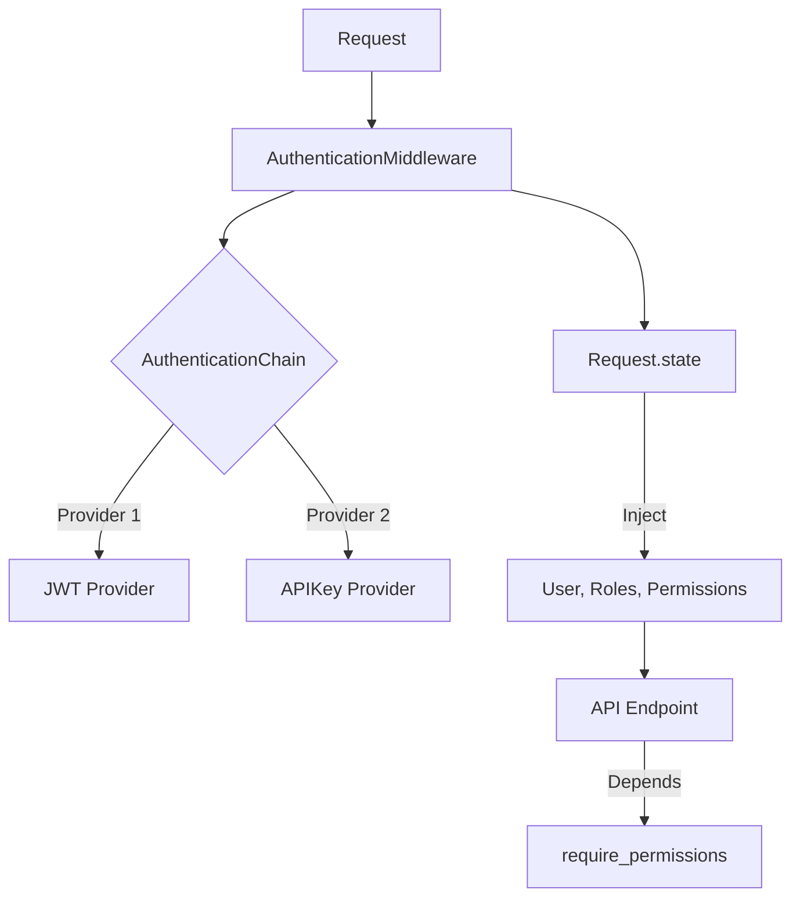

# PySpring Security Framework 深度指南

PySpring 提供了一套借鉴 Spring Security 架构思想，专为 Python/FastAPI 优化的安全框架。它不仅仅是简单的 JWT实现，而是一套完整的**认证(Authentication)**、**授权(Authorization)**与**安全上下文(Security Context)**管理系统。

---

## 1. 核心架构设计

PySpring Security 采用分层架构，确保关注点分离：



### 关键组件

1. **AuthenticationMiddleware**: 全局网关，拦截所有请求，调用认证链，初始化安全上下文 (`request.state`)。
2. **LoginService**: 认证中心，负责凭据校验、上下文策略评估 (`ISecurityContextValidator`) 和 Token 签发。
3. **SecurityContextManager**: 策略引擎，在登录时汇聚所有验证器的结果，决定是否允许登录，以及是否注入动态权限。
4. **TokenManager**: 双层 Token 架构 (Access/Refresh)，支持 JWT 加密和黑名单机制 (Redis)。

---

## 2. 授权体系 (Authorization)

PySpring 支持混合授权模型：**RBAC (角色/权限)** + **ABAC (属性/上下文)**。

### 2.1 静态权限 (RBAC)

标准的关系型数据库权限模型：
`User` -> `UserRole` -> `Role` -> `RolePermission` -> `Permission`

当用户登录时，`LoginService` 会自动查询该链条，将所有的 Permission Code (如 `user:read`, `order:create`) 打包进 Access Token。

### 2.2 动态权限 (Context Aware)

这是 PySpring 的一大特色。权限不仅仅来自数据库，还可以根据**当前环境**动态赋予。
例如：

- 用户在**受信任设备**登录，临时赋予 `sensitive:export` 权限。
- 用户来自**内网IP**，临时赋予 `admin:access` 角色。

这些逻辑由 `ISecurityContextValidator` 实现。

---

## 3. 开发者指南

### 3.1 保护 API 路由

使用 `require_permissions` (或别名 `has_permission`) 依赖注入。

```python
from fastapi import APIRouter, Depends
from pyspring.security.authorization.schema import has_permission

router = APIRouter()


# 场景 1: 需要特定权限
@router.get("/users")
async def get_users(_=Depends(has_permission("user:read"))):
    return {"msg": "You can see users"}


# 场景 2: 需要多个权限 (AND)
@router.post("/users")
async def create_user(_=Depends(has_permission(["user:read", "user:write"], logic="AND"))):
    return {"msg": "User created"}


# 场景 3: 通配符支持
@router.delete("/users/{id}")
async def delete_user(_=Depends(has_permission("user:*"))):
    return {"msg": "Admin power"}
```

### 3.2 访问当前用户

```python
from fastapi import Request


@router.get("/me")
async def me(request: Request):
    return {
        "id": request.state.user_id,
        "email": request.state.user_email,
        "roles": request.state.user_roles,
        "permissions": request.state.user_permissions
    }
```

---

## 4. 进阶实战：ISecurityContextValidator

`ISecurityContextValidator` 是 PySpring 安全框架中最灵活的扩展点。它允许你在用户**登录瞬间**介入，执行自定义的业务安全策略。

### 接口定义

```python
from pyspring.security.authentication.interfaces.validator import SecurityValidatorResult


async def validate(self, context: Dict[str, Any]) -> SecurityValidatorResult:
    # context 包含: "user" (DB对象), "request_payload" (登录请求参数)
    return SecurityValidatorResult(
        success=True,  # 是否允许登录
        reason=None,  # 拒绝理由
        claims={},  # 需要动态合并到 Context/Token 的数据
        warnings=[]  # 提示信息
    )
```

### 实战案例：企业级安全策略组合

假设我们需要实现以下四个安全与业务策略：

1. **工作时间限制**: 普通员工只能在 9:00 - 18:00 登录，管理员不受限。
2. **设备信任**: 如果检测到受信任的设备指纹，自动授予高速下载权限 (`file:download_high_speed`)。
3. **IP 围栏**: 管理员账号必须从内网 IP 登录。
4. **订阅权益**: 根据用户的会员等级 (Pro/Enterprise)，自动注入 API 配额信息。

#### 步骤 1: 创建验证器组

```python
# src/pyspring/security/custom/validators.py
import datetime
from typing import Dict, Any
from pyspring.core.ioc.annotations.component import Component
from pyspring.security.authentication.interfaces.validator import ISecurityContextValidator, SecurityValidatorResult


@Component
class WorkingHoursValidator(ISecurityContextValidator):
    @property
    def name(self) -> str:
        return "WorkingHoursPolicy"

    async def validate(self, context: Dict[str, Any]) -> SecurityValidatorResult:
        user = context.get("user")

        # 假设 admin 不受限制
        if user.email.startswith("admin"):
            return SecurityValidatorResult(success=True)

        # 检查时间
        now = datetime.datetime.now().time()
        start = datetime.time(9, 0)
        end = datetime.time(18, 0)

        if not (start <= now <= end):
            return SecurityValidatorResult(
                success=False,
                reason="Login restricted to working hours (09:00 - 18:00)",
                warnings=["Attempted login outside working hours"]
            )

        return SecurityValidatorResult(success=True)


@Component
class DeviceTrustValidator(ISecurityContextValidator):
    @property
    def name(self) -> str:
        return "DeviceTrustPolicy"

    async def validate(self, context: Dict[str, Any]) -> SecurityValidatorResult:
        request_payload = context.get("request_payload")

        device_id = getattr(request_payload, "device_id", None)

        claims = {}
        warnings = []

        if device_id == "TRUSTED_DEVICE_001":
            # 动态注入角色
            claims = {
                "roles": ["device_trusted"],
                "permissions": ["file:download_high_speed"]
            }
            warnings.append("Trusted device detected: High speed download enabled")

        return SecurityValidatorResult(
            success=True,
            claims=claims,
            warnings=warnings
        )


@Component
class IPRestrictionValidator(ISecurityContextValidator):
    """
    IP 访问控制策略
    限制只能从特定 IP 段访问 sensitive 账号
    """

    @property
    def name(self) -> str:
        return "IPRestrictionPolicy"

    async def validate(self, context: Dict[str, Any]) -> SecurityValidatorResult:
        # 注意: 这要求 LoginService 在构建 context 时传入 'client_ip' 或 'request' 对象
        # 通常需要在 Controller 层获取 request.client.host 并传递给 Service
        client_ip = context.get("client_ip")
        user = context.get("user")

        if not client_ip:
            # 如果获取不到 IP，为了安全起见可以选择拒绝，或者放行(取决于策略)
            # 这里选择放行但记录警告
            return SecurityValidatorResult(success=True, warnings=["IP verification skipped (No IP provided)"])

        # 示例逻辑: 管理员只能从内网登录
        if user.email.startswith("admin"):
            if not client_ip.startswith("192.168.") and client_ip != "127.0.0.1":
                return SecurityValidatorResult(
                    success=False,
                    reason=f"Admin login is restricted to intranet. Your IP: {client_ip}"
                )

        return SecurityValidatorResult(success=True)


@Component
class SubscriptionPlanValidator(ISecurityContextValidator):
    """
    订阅权益注入策略
    根据用户的订阅等级(Standard/Pro/Enterprise)，动态注入配额或功能权限
    """

    @property
    def name(self) -> str:
        return "SubscriptionPlanPolicy"

    async def validate(self, context: Dict[str, Any]) -> SecurityValidatorResult:
        user = context.get("user")

        # 模拟从 SubscriptionService 获取用户订阅信息
        # plan = await self.subscription_service.get_plan(user.id)
        plan = "PRO"  # 假设用户是 PRO 会员

        claims = {}
        if plan == "PRO":
            claims = {
                "quota_limit": 10000,  # 每日 API 配额请求数
                "features": ["ai_analysis", "export_pdf"]  # 注入前端可见的特性标志
            }
        elif plan == "FREE":
            claims = {
                "quota_limit": 100
            }

        return SecurityValidatorResult(success=True, claims=claims)

```

#### 步骤 2: 注册验证器

PySpring 框架支持**自动发现**机制。

只需确保你的 Validator 类：

1. 继承了 `ISecurityContextValidator` 接口。
2. 使用 `@Component` / `@Service` 装饰器标记为 IoC 托管组件。
3. **关键**: 确保该类所在的文件被 Python 导入（Imported）。

由于 PySpring 是一个框架，你的业务代码通常位于自己的项目目录中（例如 `my_app/security/validators.py`）。为了让 IoC 容器发现这些类，你需要在应用启动入口（如 `main.py` 或 `__init__.py`）导入它们，或者让它们位于自动扫描的包路径下。

```python
# 示例: my_app/security/policy.py
from pyspring.core.ioc.annotations.component import Component
from pyspring.security.authentication.interfaces.validator import ISecurityContextValidator, SecurityValidatorResult


@Component
class MyCustomPolicy(ISecurityContextValidator):
    # 实现逻辑...
    pass
```

```python
# 示例: main.py (确保导入)
import my_app.security.policy  # 导入模块以触发注册
from pyspring.core.boot import SpringApplication

# 启动应用时，框架会自动扫描已加载的模块中实现了 ISecurityContextValidator 的单例
```

### 结果验证

当用户满足 `DeviceTrustValidator` 条件登录后：

1. **Console Log**:
   ```
   INFO: LoginService - ➕ 合并动态角色: ['device_trusted']
   INFO: LoginService - ➕ 合并动态权限: ['file:download_high_speed']
   ```

2. **Access Token Payload**:
   ```json
   {
     "sub": "1",
     "roles": ["user", "device_trusted"],
     "permissions": ["user:read", "file:download_high_speed"]
   }
   ```

3. **API Access**:
   用户现在可以访问受保护的路由：
   ```python
   @router.get("/download")
   async def download( _ = Depends(has_permission("file:download_high_speed"))):
       return FileResponse(...)
   ```
