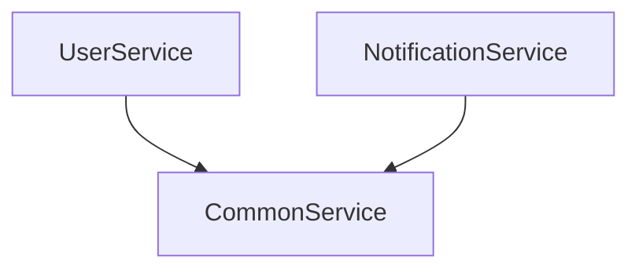

# PySpring 启动报错：循环依赖 (CircularDependencyError)

如果你的应用启动失败并出现 `CircularDependencyError`，说明你的服务之间存在环状依赖关系。

## 本质原因

PySpring 在 v1.0.1 引入了启动时依赖环检测。如果你有如下代码：

```python
# Service A 依赖 B
@Service
class UserService:
    def __init__(self, notif_service: NotificationService): ...

# Service B 依赖 A
@Service
class NotificationService:
    def __init__(self, user_service: UserService): ...
```

这构成了 A -> B -> A 的死循环。如果允许启动，调用任何一个服务都会导致无限递归（RecursionError）。

## 错误信息示例

```text
pyspring.core.exceptions.CircularDependencyError: 
❌ Circular dependency detected in IoC container:
-> user_service
   -> notification_service
      -> user_service
```

箭头表示依赖方向，最后一行指回了起点，构成了闭环。

## 解决方案

### 1. 最佳实践：提取第三个服务 (Refactor)

将 A 和 B 共同需要的逻辑提取到 Service C 中，让 A 和 B 同时依赖 C。



### 2. 使用延迟获取 (Lazy Lookup)

**不推荐用于核心业务**，但在遗留代码重构时有用。
不要在 `__init__` 中注入，而是在方法内部通过 `container.get()` 获取。

```python
@Service
class UserService:
    # 移除构造函数中的 NotificationService 依赖
    def __init__(self):
        self.container = ApplicationContext.get_instance().container

    def register(self):
        # 运行时延迟获取
        notif_service = self.container.get('notification_service')
        notif_service.send(...)
```

### 3. 使用事件驱动 (Event Driven)

解耦强依赖，改用事件总线。UserService 发出 `USER_CREATED` 事件，NotificationService 监听该事件。

---

> **注意**: PySpring 目前不支持 Setter 注入或 `@Lazy` 属性注入来打破循环（这在 Python 中实现起来较为神奇且易出错），**重构代码结构**永远是解决循环依赖的第一选择。
